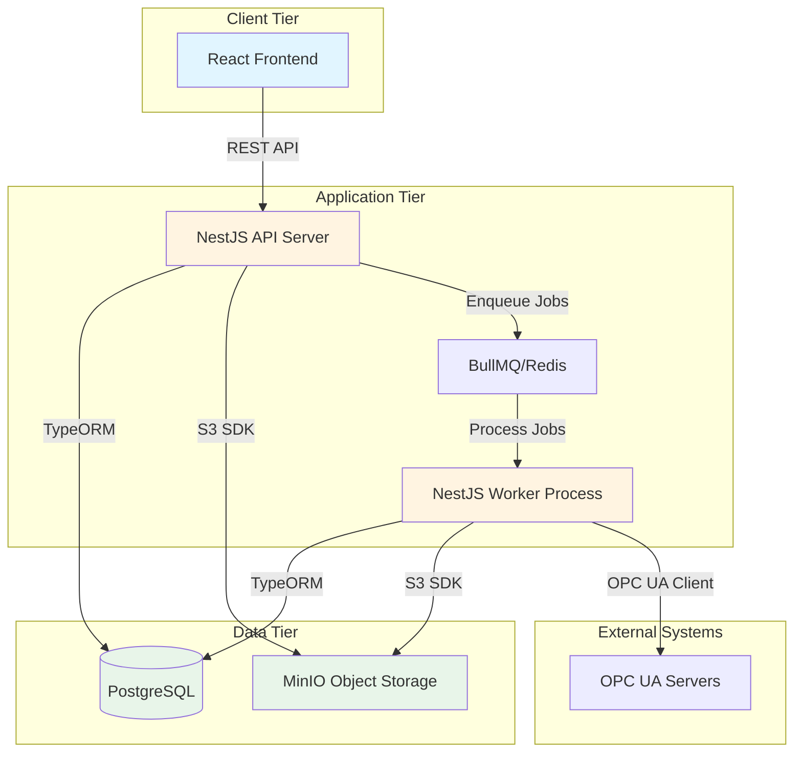

# Design Document: PAStools Platform

## Overview

PAStools is a three-tier web application for industrial control systems engineering data management. The architecture consists of:

1. **Frontend**: React + TypeScript SPA with Material-UI components
2. **Backend**: NestJS REST API with TypeORM for database access
3. **Database**: PostgreSQL for relational data storage
4. **Object Storage**: MinIO (S3-compatible) for file attachments
5. **Job Queue**: BullMQ (Redis-backed) for asynchronous processing
6. **Worker**: Separate NestJS worker process for background jobs

The system is designed to be vendor-agnostic with a plugin architecture that allows vendor-specific functionality to be added without modifying core code.

## Architecture

### System Architecture Diagram



### Technology Stack

**Frontend:**
- React 18 with TypeScript
- Material-UI (MUI) for component library
- React Router for navigation
- React Query for API state management
- Axios for HTTP requests
- Recharts for dashboards and visualizations

**Backend:**
- Node.js 20 LTS
- NestJS framework with TypeScript
- TypeORM for database ORM
- Passport.js for authentication
- class-validator for input validation
- BullMQ for job queue
- node-opcua for OPC UA client
- AWS SDK for S3-compatible storage

**Database:**
- PostgreSQL 15 with JSONB support for flexible metadata

**Infrastructure:**
- Docker and Docker Compose for deployment
- MinIO for local S3-compatible storage
- Redis for job queue and caching

### Plugin Architecture

Plugins are loaded from the `plugins/` directory and must implement defined interfaces:

```typescript
interface Plugin {
  name: string;
  version: string;
  vendor: string;
  
  // Optional plugin capabilities
  importers?: ImporterDefinition[];
  exporters?: ExporterDefinition[];
  validators?: ValidatorDefinition[];
  vendorLogic?: VendorLogicDefinition;
}
```

Plugins register themselves at application startup and their capabilities are made available through the core system.

*[Rest of design document content - truncated for brevity but would include all the detailed content from the uploaded file]*